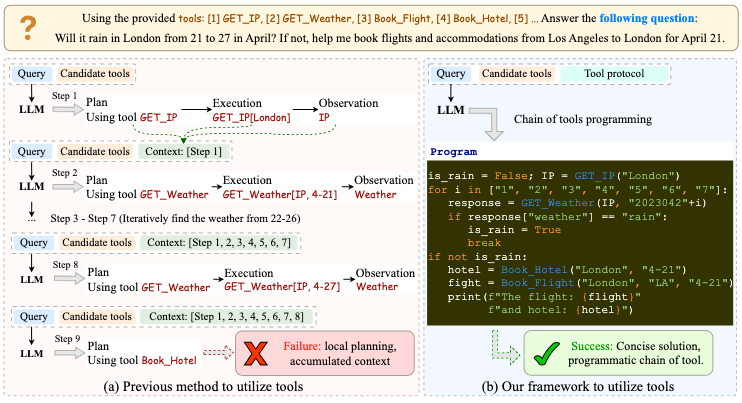
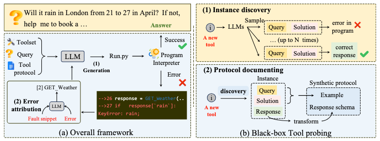

# Automatic Tool Chain (ATC)
The main code for 'Chain of Tools: Large Language Model is an Automatic Multi-tool Learner'

This project aims to enable the LLM as an Automatic Multi-tool Learner, which can automatically utilize a chain of various tools through programming.


## News
- **[2023.05.25]** New version ATC is released.
- **[2024.03.09]** Initial version ATC is released.


# Quick start


## LLM as an Automatic Multi-tool User
1. directly instruct the LLMs to operate a chain of tools programmatically.
```txt
python run_wo_attribute.py
```

2. instruct the LLMs to first operate a chain of tools programmatically, and then revise the errors in the generated programs.
```txt
python run_w_attribute.py
```

## LLM as an Active Multi-tool learner
1. instruct the LLM to automatically discover the tool usage and document the tool protocol. (black-box tool probing)
```txt
python run_probing.py
```

